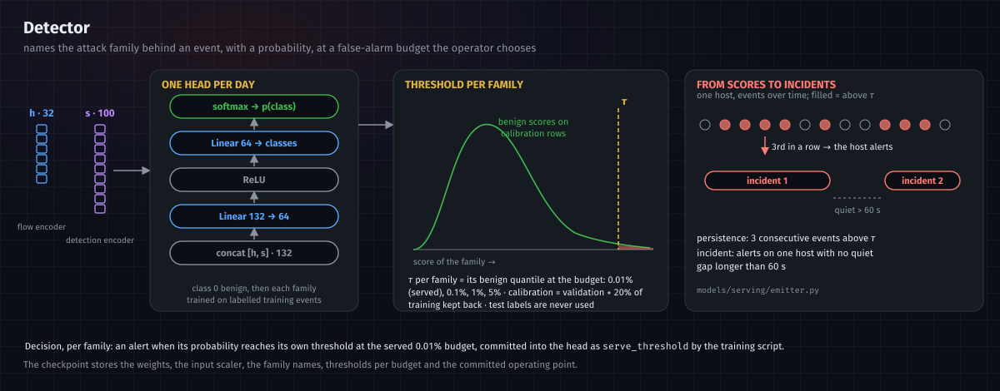
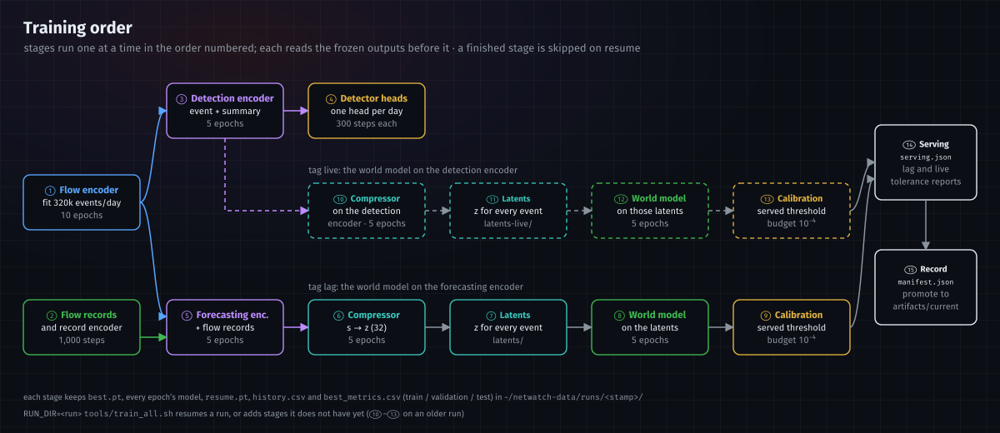

# Architecture

NetWatch reads network traffic and answers two questions about it:

1. **Detection** — *is this flow an attack, and which kind?* Decided **10 milliseconds** after the flow's first packet,
   while the connection is still open.
2. **Forecasting** — *given what the network is doing, which host is the campaign likely to reach next?* A world model
   keeps a running state of every host and rolls it forward.

This document explains every stage: what it receives, what it produces, how it is built, and why it is built that way.
Terms are defined where they first appear.

---

## Contents

1. [The pipeline at a glance](#1-the-pipeline-at-a-glance)
2. [Rules every stage follows](#2-rules-every-stage-follows)
3. [Ingest: from packet captures to an event stream](#3-ingest-from-packet-captures-to-an-event-stream)
4. [Flow encoder](#4-flow-encoder)
5. [Context encoder](#5-context-encoder)
6. [Detector](#6-detector)
7. [Compressor](#7-compressor)
8. [World model](#8-world-model)
9. [Explanations](#9-explanations)
10. [How the stages are trained](#10-how-the-stages-are-trained)
11. [Where each stage lives in the code](#11-where-each-stage-lives-in-the-code)

---

## 1. The pipeline at a glance

**What an event is.** One *flow* — a conversation between two hosts on one pair of ports, as CICFlowMeter defines it —
becomes one *event*. Everything after ingest works on the event stream: events in the order they became available.
Time is never cut into fixed windows; each event keeps its own microsecond timestamps.

**Why a cascade of separately trained stages.** Each stage is trained on its own, then *frozen* (its weights no longer
change) before the next stage is trained on its output. Gradients never cross a stage boundary. This keeps every
stage's contribution measurable on its own, lets a later stage be retrained without touching earlier ones, and fits
the training in the memory of one workstation.

**Why two context encoders.** The detector and the world model need different information. The detector must decide
at 10 ms, so its context encoder (the *detection encoder*) sees packets and the 20-packet summary only. The world model
watches the network over time, so its context encoder (the *forecasting encoder*) also receives each flow's complete
record when the flow ends. The two share one design and are trained separately (see [§5](#5-context-encoder)).

**Why the world model is trained twice.** A forecast is useful only while its predictions are still ahead. The
forecasting encoder needs complete flows, and a flow is complete only after CICFlowMeter's 120 s timeout, so a world
model fed through it runs about 150 s behind the traffic (serving tag `lag`). A second compressor and world model are
trained on the detection encoder's output, which exists 10 ms into every flow, and are served seconds behind the
traffic (tag `live`). Both are served; [serving.md §4](serving.md#4-serving-tags) compares them.

---

## 2. Rules every stage follows

### 2.1 Two times per event

| time | definition | used for |
|---|---|---|
| `t` | the flow's first packet | identity; "time since this host's previous flow" |
| `t_obs` | `min(t + 10 ms, end of flow)` | **when the event becomes available**, and the order the stream is processed in |

A flow still running at 10 ms is scored at `t + 10 ms` with the packets seen by then. A flow that ends sooner (a short
DNS query, for example) is scored when it ends — there is nothing more to wait for.

### 2.2 Nothing is used before it exists

The stream is processed in `t_obs` order (ties broken by event id), not by start time. Anything derived from an event —
its packets, its embedding, its effect on memory — can influence another event only after its own `t_obs`.

This is why events may be *processed* in a different order from their start times:

When B is processed, A's 10 ms of packets do not exist yet, so B must not see them. Processing by start time would
let B read A's future; processing by availability prevents it. B may still know that A *started* at 0 ms, because that
first packet has already arrived.

Late information follows the same rule. A flow's 20-packet summary exists when its 20th packet arrives; its CICFlowMeter
record exists when the flow ends. Both reach the model as separate, later messages at those times, never as part of the
10 ms decision.

### 2.3 Two populations, reported separately

| population | meaning |
|---|---|
| `early_observation` | the flow was still running at 10 ms — a decision here is genuinely early |
| `completed_before_budget` | the flow had already ended — this is detection, not early warning |

Results are reported per population and never pooled: pooling lets fast, easy flows hide how the system does on the
early ones.

### 2.4 What never becomes an input

| kind | columns | why |
|---|---|---|
| identity | IP addresses, ports, capture name, flow id, day | they identify *who*, not *what the traffic does*; a model that learns an attacker's IP learns nothing that transfers |
| labels | `Label`, `attack_name`, `label_source`, `label_confidence`, `label_direction` | ground truth for evaluation only |
| clock | absolute timestamps, event ids, CICFlowMeter's Active/Idle columns | absolute time locates the attack window instead of describing behaviour; this CICFlowMeter build writes epoch time into the Idle columns |
| TTL | packet TTL and its aggregates (zeroed) | reports network distance to the host, not behaviour |

Hosts reach the models only as node numbers, and ports only as two derived features (`port_delta`, `dst_port_new`).
`models/data/inputs.py::check_features` refuses to build an input that contains a forbidden column.

### 2.5 How data is split and fitted

- **Split: 60% / 10% / 30%** of each segment's *time span* into train / validation / test. A segment is one attack
  window or one benign stretch between attacks, so every split contains every attack family. A 120-second gap is left
  unused at each boundary so no flow straddles two splits (`models/data/splits.py`).
- **Normalisation** (scaling inputs to comparable ranges) is fitted on **benign training rows only**, then stored inside
  the checkpoint, so live scoring uses exactly the same scale.
- **Autoencoders and the context encoder train on benign traffic only.** They learn what normal looks like; attacks are
  what they describe badly. Only the detector and the world model's ranking head use attack labels.

---

## 3. Ingest: from packet captures to an event stream

`ingest/` turns raw captures into tables. It is plain data processing — no learning.

| step | input | output | what happens |
|---|---|---|---|
| select captures | a day's folder of files | the list of captures | a file is a capture if it starts with a pcap/pcapng header and its first packet falls on that day; every rejected file is reported |
| packets (`ingest/sources/packets.py`) | one capture | `packets.parquet`, one row per packet | tshark extracts time, addresses, ports, protocol, length, TTL, TCP window, the six TCP flags, IP flags, retransmission, payload length and the first 128 payload bytes |
| flows (`ingest/sources/flows.py`) | one capture | `flows.parquet`, one row per flow | CICFlowMeter groups packets into two-way flows and computes 76 statistics. A flow ends at a packet with FIN set, or at its first packet more than 120 s after the flow started; a flow with one packet is never written |
| labels (`ingest/sources/flows.py::LabelMatcher`) | flow and packet records | 5 label columns | the dataset's published attack schedule (attacker and victim IPs, time windows, ports) decides what is an attack; victim replies are labelled too |
| edges (`ingest/build/join.py`) | flows | `edges.parquet` | each flow as a timestamped edge between two hosts |
| flow ↔ packet map (`ingest/build/join.py`) | flows, packets | `flow_packet_map.parquet` | which flow each packet belongs to, by an interval join (same 5-tuple **and** inside the flow's time span). A key join is wrong: the same 5-tuple is reused by many flows |
| **event stream** (`ingest/build/events.py`) | a day's flows, packets and map | `events.parquet`, `node_index.parquet` | see below |

**Building the event stream:**

1. **Start time from the first packet.** CICFlowMeter's timestamp has one-second resolution; the first packet's has
   microseconds, so the stream keeps its order.
2. **20 packet aggregates** over each flow's first 20 packets: count, mean and spread of size / TTL / TCP window /
   inter-arrival time, count of each TCP flag, payload bytes and share, retransmissions, fragments.
3. **Duplicate removal.** CICFlowMeter emits a forward and a reverse record for one conversation; the one without
   packets is dropped when its twin has them.
4. **Node ids.** Every IP gets a number by first appearance *within the day*. The same host has a different number on
   another day, so nothing keyed on node ids is carried across days.
5. **Per-host history, from earlier events only:** `dt_src` / `dt_dst` (seconds since the record's source last
   appeared as a source, and its destination as a destination; −1 the first time), and, keyed on the client (the side
   `reversed` names as the initiator), `port_delta` (the port it dialled minus the one it dialled before) and
   `dst_port_new` (1 if it never dialled this port before) — a port-scan signature.
6. **Orientation.** `reversed` says whether the record runs server → client, judged from a bare SYN or, failing that,
   from which side uses the higher port. It never reads a label.

Two more tables are built from the processed packets for the context encoder:

| table | built by | content |
|---|---|---|
| `side_features.parquet` | `models/context_encoder/features.py` | per event, as seen at `t_obs`: which host sent the first packet (the *sender*) and which received it, request and response packet counts, reply latency, direction changes, no-reply flag |
| `flow_records.parquet` | `models/context_encoder/records.py` | per event, CICFlowMeter's record (68 columns, oriented to match the first packet's direction) and `record_time`, the earliest moment it can exist (the flow's last packet) |

Every column is listed in [data.md](data.md).

---

## 4. Flow encoder

**Job.** Describe one flow, from what can be seen in its first 10 ms, as 32 numbers (`h`). No other traffic is looked
at; network context is the context encoder's job.

### Input (per flow, at `t_obs`)

| input | size | content |
|---|---|---|
| summary `a_f` | 40 | the 20 packet aggregates, recomputed from **only the packets seen by `t_obs`**, once for the sender's packets and once for the receiver's, side by side |
| packets | up to 20 × 13 | length, TTL (zeroed), TCP window, 6 TCP flags, payload length, retransmission, fragment, direction |
| gaps | up to 20 | time since the flow's previous packet |

In practice the median flow has 2 packets in its first 10 ms. IP addresses, ports and payload bytes are not inputs.

### A small graph per flow

| part | what it is | features |
|---|---|---|
| packet node πᵢ | one packet | its 13 packet features → 64 numbers, plus a learned tag for "sender" or "receiver" |
| flow node | the flow as a whole | `a_f` → 64 numbers |
| **contain** edge | flow → each of its packets | none |
| **link** edge | packet → a later packet, of two kinds: *same-side* (the next packet from the same host) and *reply* (a packet answered by the other host) | the time between the two packets, encoded as 16 numbers, plus 2 numbers marking the kind |

The time between packets is encoded as `log(1 + seconds)` multiplied by 8 learned frequencies and passed through sine
and cosine, so microseconds and seconds are both represented well.

**How the graph is read.** Two graph layers update every packet node from the messages arriving along its incoming
edges: from the packets before it (the *link* edges, which carry the timing) and from the flow node (the *contain*
edges, which carry the summary). The flow node only sends — nothing points into it, so it is never updated, and the
graph library warns about that when the model is built. That is intended: the summary's job is to give each packet
context (a 60-byte packet means something different in a 2-packet flow than in a 20-packet one), and the summary also
reaches the output directly.

**Output.** The packet nodes are combined with a mean and a max (64 + 64), joined to `a_f` (40), and a small network
maps the 168 numbers to **`h`, 32 numbers**.

### Why the directions are kept apart

A request and its answer mean different things: a flood is many requests and few replies; a normal exchange alternates.
Separate sender/receiver tags, separate same-side chains and explicit reply edges keep the two directions from being
blurred together, and the reply edges carry the reply latency.

### How it learns (benign flows only)

The flow encoder is an **autoencoder**: it compresses its input to `h`, and small decoders must rebuild from `h`

1. the summary it was given,
2. the packets it was given (every slot's features, its gap, and whether a packet was present), and
3. a **forecast** — the full 20-packet summary the flow will eventually have (`a_future`), which it cannot see yet.

The loss is how badly these are rebuilt. Because it trains only on benign flows, `h` becomes a compact description of
normal flows, and unusual flows are rebuilt badly. The full summary is only ever a *target*; the encoder never reads it.

Training samples 320,000 events per day to fit on (the export afterwards embeds every event). The encoder has 65,000
parameters; with the decoders, 124,000.

### Output

- `h` (32) and a reconstruction error for **every** event → `flow_embeddings.parquet`.
- The checkpoint stores the weights **and** the normalisation statistics, so live scoring uses the same scale.

**How it is checked.** A small classifier (a *probe*) is trained on frozen `h` to separate attacks from benign flows and
scored on held-out test rows, per population and per family. This measures how much attack information `h` carries,
although the flow encoder never saw a label.

---

## 5. Context encoder

**Job.** Place each event in its network context: what this link has been doing, and what the two hosts have been doing
with everyone else. Output: **`s`, 100 numbers** per event.

The flow encoder sees one conversation in isolation. Many attacks are only visible in context — one failed login is normal, a
hundred in a minute from one host is not.

### Nodes and links

The context encoder works on a stream, not a fixed graph:

- **Hosts** are the endpoints of events (node ids from ingest).
- **A link** is one *direction* between two hosts: `sender → receiver`. The sender is the host that sent the flow's
  first packet. Keying on the sender (rather than on CICFlowMeter's Src/Dst, which differs from it on 11–30% of events, depending on the day)
  keeps both halves of a conversation on one link.
- **Link memory**: one state of 100 numbers per link, kept across events and updated by a GRU (a small recurrent
  network that folds each new message into the running state).
- **Neighbourhood**: for each event, up to **20 recent events** — the latest event with each of the most recent
  *distinct peers* of the sender and of the receiver, leaving out earlier events on this same sender → receiver link.
  "Distinct peers" matters: a flood fills "the 20 most recent events" with copies of itself, while "the latest event
  per peer" still shows who else each host talks to.

### What one event reads

*Attention* weighs the neighbours: the model learns how much each recent event should count for this one, and the
weights are kept for explanations ([§9](#9-explanations)).

### What updates the memory

Three kinds of message update a link's memory, each at the moment it becomes available:

| message | when | content | used by |
|---|---|---|---|
| **event** | at `t_obs` | the event's `h` plus a request marker | both context encoders |
| **20-packet summary** | when the flow's 20th packet arrives | the full 20 aggregates | both context encoders |
| **flow record** | when the flow ends | CICFlowMeter's 68 columns plus a direction flag (69), through a small frozen *record encoder* trained on benign records | the forecasting encoder only |

A message is held until every event of the batch being processed is at or after its time, so it is never applied early;
it may be applied up to one batch late. A flow's own late messages can therefore never influence that flow's own
decision — only later events on the same link. This is what lets the context encoder see a flood: one finished flow looks normal,
hundreds of completion messages piling up on one link do not.

Messages of different kinds are combined by keeping each kind in its own slot with a presence flag, so "a record
arrived" stays distinguishable from "an event arrived". A link unused for an hour returns to its starting state, and the
table keeps at most a quarter of the day's links in training (least recently used are dropped; a fixed 250,000 slots in
the live detector), which bounds memory in a live process.

### How it learns (benign events only)

**Link prediction.** For each real event, the context encoder computes `s` for the real link and for a fake one — the same event
rewritten as if it went to another event's receiver. A small scorer must tell real from fake. To do that, `s` has to
capture how normal traffic flows between hosts. Events are processed in batches of 512; that batch size is also how
stale the memory is allowed to be, so live serving uses the same batch size.

### Two context encoders

| | detection encoder (`b8det`) | forecasting encoder (`b8`) |
|---|---|---|
| messages | event + 20-packet summary | event + 20-packet summary + flow record |
| why | the detector decides at 10 ms; a flow record describes a finished flow and must not shape the detector | the world model follows the network over time and benefits from each completed flow |
| feeds | the detector, and the `live` world model | the `lag` world model |

---

## 6. Detector

**Job.** Name the attack family behind an event, with a probability, at a false-alarm budget the operator chooses.

| | |
|---|---|
| input | `[h, s]` = 32 + 100 = **132 numbers**, from the flow encoder and the detection encoder |
| model | one hidden layer of 64, one output per class (benign first, then each family) |
| training | supervised, on labelled events of the training split; one head per day |
| threshold | for each family, a quantile of **benign** scores on held-out calibration rows (validation + 20% of training kept back) at each false-alarm budget (0.01%, 0.1%, 1%, 5%). Test labels are never used |
| decision | per family: an alert when that family's probability reaches **its own** threshold. The served budget is 0.01% false alarms; each family's threshold at it is committed into the head as `serve_threshold` (`models/evaluation/thresholds.py`, run by the training script) and is what the live detector serves |
| checkpoint | weights, the input scaler, the family names, thresholds per budget, and the committed operating point (`serve_threshold`) |

**From scores to alerts** (`models/serving/emitter.py`). Raw per-event alerts are too many to show a person. Two rules
turn them into something readable:

1. **Persistence** — a host alerts only after 3 consecutive events above threshold.
2. **Incidents** — alerts on one host with no quiet gap longer than 60 s are one incident.

---

## 7. Compressor

**Job.** Compress each event's context `s` (100 numbers) to **`z` (32 numbers)** for the world model, and give a
reconstruction error that says how unlike benign traffic the event's context is.

| | |
|---|---|
| input | `s` from a frozen context encoder, standardised on benign training events: the forecasting encoder's for the `lag` world model, the detection encoder's for the `live` one (each pair is trained separately) |
| encoder | normalise → 128 → **32** (`z`) |
| decoder | 32 → 128 → 100, rebuilding `s` |
| training | benign events only; loss = how badly `s` is rebuilt |
| output | `event_latents.parquet`: per event `z`, `recon_error`, the event's times, hosts, split and (for evaluation only) its label |

`z` is one row per event, but it is not memory-free: `s` already contains the link memory and the neighbourhood, so `z`
is *this event, in the light of its history*. It never contains future events.

---

## 8. World model

**Job.** Keep a running state of every host, learn how the network normally evolves, measure how surprising each new
event is, and roll the state forward to forecast which hosts a campaign reaches next.

### Nodes and state

- **Nodes** are hosts (node ids from ingest). Each has a **memory**: 100 numbers, zero at the start of a day.
- **Events** arrive in `t_obs` order, each carrying its sender, receiver, `z` (32) and the time since each endpoint was
  last seen.
- Memory is reset at every day boundary, because node ids are assigned per day.

### How memory is updated

For each event, a *message* is built from both endpoints' memories, `z`, and both time gaps (each gap encoded as 100
numbers: 50 learned frequencies as sine/cosine pairs, or a learned "never seen" vector when the host is new). A small
network maps the 432 numbers to a 100-number message, and a GRU folds it into **both** endpoints' memories. Events are
processed in chunks of 512; within a chunk, the latest event for each host wins, chosen explicitly so the result is the
same on every run.

### How a host is read

| layer | what it does |
|---|---|
| **Layer 1 — neighbourhood** | a host attends over up to 20 hosts it recently exchanged events with; each neighbour is described by its memory and how long ago it acted. The host's reading is its own memory **plus** what it attended to |
| **Layer 2 — global readout** | two learned queries pool over every recently active host: a network-wide summary, one query tending to fast bursts, the other to slow and quiet activity |

### Heads

| head | question | used for |
|---|---|---|
| **next-event** | "will these two hosts interact next?" — a score per host pair | its error on a real event is that event's **surprise** |
| **ranking** | "which active host does the campaign reach next?" — each candidate host is compared against both global queries | the forecast's next targets |

### Training

- **Next-event**: each real event against one negative — its initiator paired with another event's responder from the
  same chunk, so the negative comes from the same traffic. Uses no labels.
- **Ranking**: supervised by the attacker/victim roles derived from the labels, on days that have them: the true target
  against 5 negative candidates.
- One chunk of 512 events at a time, in `t_obs` order.

### Rollout (the forecast)

From the latest state, the model imagines events one step at a time: the ranking head picks the next target, the
imagined event updates memory, and the next step starts from there. Nothing observed is fed back in. Six steps are
served. A step is **one event**, not a unit of time: the display spaces steps 1 s apart only for drawing.

### Calibration

A score (surprise or target probability) and its direction are chosen on validation data: the direction from its
ROC-AUC, the score by its recall at the serving budget, since an alert lives only in the far tail that AUC barely
weighs (`--score` overrides the choice). The threshold is the quantile
of benign scores (validation + 20% of training) at a 1-in-10,000 false-alarm budget. The threshold is stored inside the
checkpoint with the recall and false-alarm rate measured at it, and it belongs to that one trained model.

### Output files

`risk_scores.parquet` (surprise and ranking per event), `rollout_trajectories.parquet` (one row per forecast step),
`attention_weights.parquet` (which hosts each event's reading attended to).

---

## 9. Explanations

| question | answer comes from | code |
|---|---|---|
| which recent events made the context encoder see this event the way it did? | the context encoder's attention over the neighbourhood — the model's own weights, not a fitted surrogate | `models/explanation/attention.py` |
| did the detector decide from the flow itself or from its context? | gradient × input over the detector's 132 inputs, summed for the 32 flow numbers and the 100 context numbers | `models/explanation/attention.py` |
| why is the forecast starting from this host? | the world model's neighbourhood attention for each forecast seed, summed per peer host | `models/explanation/world_model.py` |

Capturing attention is switched off in training and verified to leave every output bit-identical when switched on, so
asking for an explanation cannot change a decision.

---

## 10. How the stages are trained

`tools/train_all.sh` runs this whole order in one command, keeps every epoch's model, and records train / validation /
test metrics for each stage; the `live` compressor and world model are trained last, on the detection encoder. See
[training.md](training.md).

---

## 11. Where each stage lives in the code

| stage | package | entry point |
|---|---|---|
| ingest | `ingest/` | `python -m ingest.cli`, `python -m ingest.build.events` |
| inputs, 10 ms cut, splits | `models/data/` | — |
| flow encoder | `models/flow_encoder/` | `python -m models.flow_encoder` |
| side features, flow records | `models/context_encoder/features.py`, `records.py` | `python -m models.context_encoder.records` |
| context encoder | `models/context_encoder/` | `python -m models.context_encoder` |
| detector | `models/detector/` | `python -m models.detector` |
| compressor | `models/compressor/` | `python -m models.compressor` |
| world model | `models/world_model/` | `python -m models.world_model`, `python -m models.world_model.calibration` |
| explanations | `models/explanation/` | `python -m models.explanation` |
| serving | `models/serving/` | see [serving.md](serving.md) |
| evaluation | `models/evaluation/` | `python -m models.evaluation` |

Each package has a README with its files, inputs, outputs and settings.
