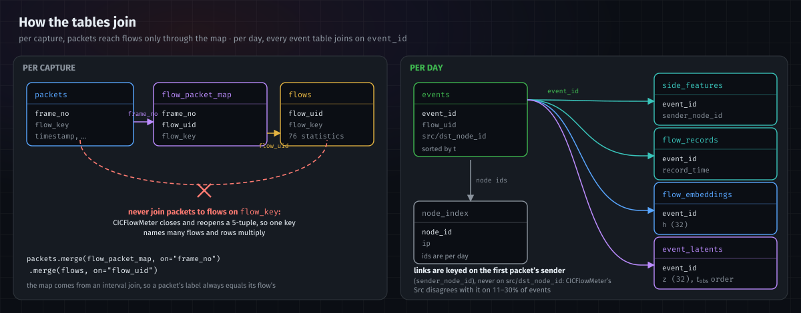
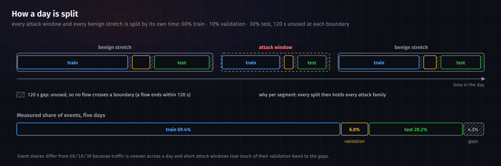

# Data

Every table the pipeline writes, what each column means, and how the tables join. For how they are produced and why,
see [architecture.md](architecture.md).

All timestamps are **UTC epoch seconds**. The dataset's attack schedule is published in local time (UTC−4); only the
labeller converts.

---

## Where things are written

| path | produced by | one row per |
|---|---|---|
| `data/raw/<day>/` | the CSE-CIC-IDS2018 download | — |
| `data/processed/<day>/<capture>/packets.parquet` | ingest | packet |
| `data/processed/<day>/<capture>/flows.parquet` | ingest | flow |
| `data/processed/<day>/<capture>/edges.parquet` | ingest | flow |
| `data/processed/<day>/<capture>/flow_packet_map.parquet` | ingest | packet |
| `data/events/<day>/events.parquet`, `node_index.parquet` | `ingest.build.events` | event / host |
| `data/context_features/<day>/side_features.parquet` | `models.context_encoder.features` | event |
| `data/context_features/<day>/flow_records.parquet` | `models.context_encoder.records` | event |
| `<run>/embeddings/split/<day>/flow_embeddings.parquet` | flow encoder export | event |
| `<run>/latents/<day>/event_latents.parquet` + `latents_manifest.json` | compressor export (`lag` world model) | event |
| `<run>/latents-live/<day>/event_latents.parquet` + `latents_manifest.json` | compressor export (`live` world model) | event |
| `risk_scores.parquet`, `rollout_trajectories.parquet`, `attention_weights.parquet` | world model `--emit` | event / forecast step / attention entry |
| `artifacts/current/` — the promoted models, `serving.json`, `manifest.json`, `metrics/` | `tools/promote.py` | — |
| `artifacts/huggingface/{model,dataset,download}/` | `tools/publish/huggingface.py`, `tools/publish/download.py` | — |

`<run>` is a training run's folder, `~/netwatch-data/runs/<stamp>/`; `artifacts/` is a git-ignored folder in the repository
(see [training.md](training.md#the-artifacts-folder)).

---

## Ingest tables (per capture)

### `packets.parquet` — 29 columns

| column | meaning |
|---|---|
| `frame_no` | position in the original capture; unique, the join key to the map |
| `timestamp` | packet time, microsecond precision |
| `src_ip`, `dst_ip`, `src_port`, `dst_port`, `protocol`, `is_ipv6` | endpoints; ports are 0 for non-TCP/UDP |
| `length`, `ttl`, `tcp_window` | frame length, TTL / hop limit, TCP receive window |
| `tcp_flag_syn`, `_ack`, `_fin`, `_rst`, `_psh`, `_urg` | TCP flags, 0/1 |
| `ip_flag_df`, `ip_flag_mf`, `ip_frag_offset` | IP fragmentation fields |
| `tcp_retransmission` | 1 when tshark marks the packet as a retransmission |
| `payload_len`, `payload` | true payload length; the first 128 payload bytes |
| `flow_key` | the two-way 5-tuple (not unique per flow, see *Joining*) |
| `Label`, `attack_name`, `label_source`, `label_confidence`, `label_direction` | labels — evaluation only |

This is the only place ICMP/IGMP appears: CICFlowMeter emits no flows for it.

### `flows.parquet` — 92 columns

| group | columns |
|---|---|
| identity (11) | `day`, `capture`, `flow_uid` (`<capture>#<row>`, **unique**), `flow_key`, `Flow ID`, `Src IP`, `Dst IP`, `Src Port`, `Dst Port`, `Protocol`, `Timestamp` (one-second resolution) |
| CICFlowMeter statistics (76) | volume, packet lengths, rates, inter-arrival times, flag counts, header and segment sizes, bulk, subflow, initial windows, Active/Idle, down/up ratio |
| labels (5) | as in packets |

The Active/Idle columns are never used: this CICFlowMeter build writes absolute epoch time into Idle on about half of
flows and zero into every Active column. Rate columns can hold infinity (zero-duration flows); the pipeline sets them to
0.

### `edges.parquet` — 15 columns

`timestamp`, `flow_key`, `src_ip`, `src_port`, `dst_ip`, `dst_port`, `protocol`, `duration` (µs), `fwd_packets`,
`bwd_packets`, and the 5 labels (with a lowercase `label`). One row per flow, as a timestamped edge between two hosts.

### `flow_packet_map.parquet` — 3 columns

`frame_no`, `flow_uid` (null when no flow contains the packet — mostly ICMP/IGMP), `flow_key`. Exactly one row per
packet.

---

## Event tables (per day)

### `events.parquet` — one row per event, sorted by `t`

| column | meaning |
|---|---|
| `event_id` | 0, 1, 2… in start-time order |
| `t` | the flow's first packet |
| `src_node_id`, `dst_node_id` | CICFlowMeter's Src / Dst as node ids (see *Direction* below) |
| `dt_src`, `dt_dst` | seconds since the source host last appeared as a source (and the destination host as a destination); −1 the first time |
| `port_delta`, `dst_port_new` | keyed on the client (the initiator, as `reversed` judges it): the port it dialled minus the one it dialled before (0 the first time); 1 if it never dialled this port before |
| `flow_uid`, `capture` | back-references to ingest |
| `has_packets` | false for the few flows with no captured packets (never scored) |
| `reversed` | 1 if the record runs server → client, 0 if client → server, −1 if unknown |
| 20 aggregates | `pkt_n`, `pkt_len_mean/std`, `ttl_mean/std`, `win_mean/std`, `iat_mean/std/max`, `syn_n`, `ack_n`, `fin_n`, `rst_n`, `psh_n`, `urg_n`, `payload_bytes`, `payload_frac`, `retrans_n`, `frag_n` — over the flow's first 20 packets |
| `label` | evaluation only |

### `node_index.parquet`

`node_id`, `ip`, `first_seen_t`, `n_events`. Node ids are assigned per day, so the same host has a different id on
another day; always map through that day's index.

### `side_features.parquet` — as seen at each event's `t_obs`

`event_id`, `sender_node_id` (the host that sent the first packet), `receiver_node_id`, `request_packets`,
`response_packets`, `reply_latency_s`, `direction_changes`, `no_reply`.

### `flow_records.parquet`

`event_id`, `record_time` (the flow's last packet: the earliest the record can exist), and 69 record columns: the 68
CICFlowMeter statistics the model may read (the 76 less the 8 Active/Idle), turned to the first packet's direction,
plus `record_reversed` saying whether they were turned.

---

## Model outputs

### `flow_embeddings.parquet` — flow encoder

`event_id`, `flow_uid`, `t`, `observation_time` (= `t_obs`), `packets_seen`, `observation_population`, `attack`, `h`
(32 numbers), `recon_error`. Exactly one row per event of the day.

### `event_latents.parquet` — compressor, the world model's input

`event_id`, `t`, `t_obs`, `sender_node_id`, `receiver_node_id`, `dt_src`, `dt_dst`, `reversed`, `z` (32 numbers),
`recon_error`, `split` (0 train, 1 validation, 2 test, −1 gap), `label`, `observation_population`, `attack`, `role`
(attacker / victim, from the labels; used only to train the world model's ranking head). Rows are in `t_obs` order and
cover the events with packets (`has_packets`). `<run>/latents/` is the `lag` world model's input; `<run>/latents-live/`,
the same format from the detection encoder, is the `live` one's.
`latents_manifest.json` beside it records what produced them.

### World model outputs

| file | one row per | columns |
|---|---|---|
| `risk_scores.parquet` | scored event | `event_id`, `t`, `next_event_pred_error` (surprise), `ranking_scores` (candidate host → score), `observation_population` |
| `rollout_trajectories.parquet` | (seed, step) | `seed_id`, `rollout_step`, `predicted_event` (sender, receiver, z), `cumulative_risk`, `stays_on_manifold`, `surprise`, `candidates` |
| `attention_weights.parquet` | (event, attended host) | `event_id`, `layer` (`neighborhood` or `global_readout`), `source_node_id`, `weight`, `query_index` (−1 for neighbourhood rows) |

---

## Joining



**Never join packets to flows on `flow_key`.** CICFlowMeter closes and reopens the same 5-tuple, so one key names many
flows; a key join multiplies rows and attaches packets to the wrong flow. Always go through the map:

```python
packets.merge(flow_packet_map, on="frame_no").merge(flows, on="flow_uid")
```

The map was built with an interval join (same key **and** inside the flow's time span), so a packet's label always
equals its flow's label.

**Direction.** CICFlowMeter's Src/Dst is not always the side that opened the connection: it disagrees with the first
packet's sender on 11–30% of events, depending on the day. The context encoder and every stage after it key links on the **first packet's sender**
(`sender_node_id` in `side_features.parquet` and `event_latents.parquet`), never on `src_node_id`/`dst_node_id`.

**Event tables** join on `event_id`, and within one day every event table has exactly one row per event, in the same
order as `events.parquet` (except `event_latents.parquet`, which is in `t_obs` order and leaves out events without
packets).

---

## Splits



`split` is 0 (train), 1 (validation), 2 (test) or −1 (gap). Each attack window and each benign stretch is split
separately, 60% / 10% / 30% of its time span, with a 120 s gap at each boundary. Measured over the five ingested days:
69.4% train, 6.0% validation, 20.2% test, 4.3% in gaps. Proportions of events differ from the time fractions because
traffic is uneven across a day and short attack windows lose much of their validation band to the gaps.
