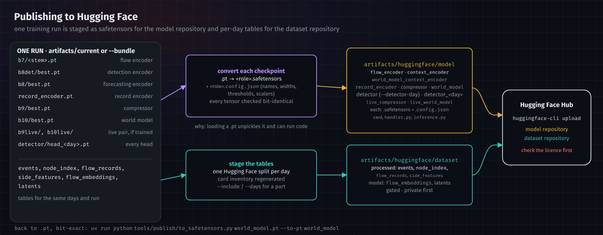

# Publishing to Hugging Face

Two repositories are staged, uploaded and downloaded inside the git-ignored `artifacts/` folder
([training.md](training.md#the-artifacts-folder)), from the models in `artifacts/current/`:

| folder | Hugging Face repository | contents |
|---|---|---|
| `artifacts/huggingface/model/` | a model repository | the trained stages as safetensors, the model card, and an inference endpoint for the detector |
| `artifacts/huggingface/dataset/` | a dataset repository (gated) | the event tables and the model's per-event outputs |
| `artifacts/huggingface/download/<repo>/` | — | a downloaded model repository, ready to serve |

The cards, `config.json`, `handler.py`, `inference.py`, `requirements.txt` and `.gitattributes` are tracked in git under
`huggingface/`; the staging tool copies them into each staged folder.



---

## 1. Stage the model

Stage from **one training run**, so every stage matches the ones it was trained with. The default is
`artifacts/current`; `--bundle <run folder>` takes a run folder instead:

```bash
uv run python tools/publish/huggingface.py --what model --user <account> --detector-day <day>
```

| role | in `artifacts/current` (in a run folder) | published as |
|---|---|---|
| detector, served by the inference endpoint | `detector/head_<day>.pt` for `--detector-day` | `detector.safetensors` + `detector.config.json` |
| every detector head | `detector/head_<day>.pt` | `detector_<day>.*` |
| detection encoder (context encoder) | `detection_encoder.pt` (`b8det/best.pt`) | `context_encoder.*` |
| forecasting encoder (context encoder) | `forecasting_encoder.pt` (`b8/best.pt`) | `world_model_context_encoder.*` |
| record encoder | `record_encoder.pt` | `record_encoder.*` |
| compressor | `compressor.pt` (`b9/best.pt`) | `compressor.*` |
| flow encoder | `flow_encoder.pt` (`b7/<stem>.pt`) | `flow_encoder.*` |
| world model | `world_model.pt` (`b10/best.pt`) | `world_model.*` |
| the `live` tag's compressor and world model, when the run has them | `live_compressor.pt`, `live_world_model.pt` (`b9live/`, `b10live/best.pt`) | `live_compressor.*`, `live_world_model.*` |

`--detector-day` is required when there is more than one head: the endpoint serves one head, and choosing it is a
decision, not a file date.

For each one the tool converts the checkpoint to **safetensors**, checks every tensor is bit-identical to the original,
writes the non-tensor fields (class names, widths, thresholds, normalisation statistics) to `<role>.config.json`, and
deletes the copied `.pt`. Epoch and resume files are ignored.

**Why safetensors.** Loading a `.pt` file unpickles it, which can run code; a public model should not ask its users to
trust the uploader. safetensors holds tensors only. The cost is that each stage becomes two files, and both must be
uploaded.

**Loading a published stage with this repository's code**, which reads `.pt`, rebuilds the file locally and bit-exact:

```bash
uv run python tools/publish/to_safetensors.py world_model.pt --to-pt world_model
```

`--dry-run` reports what would be staged, with sizes, and copies nothing.

---

## 2. Stage the dataset

```bash
uv run python tools/publish/huggingface.py --what dataset --user <account>
```

| set | portion | config to load | content |
|---|---|---|---|
| `processed` | `events` | `processed_events` | the labelled event stream |
| `processed` | `node_index` | `processed_node_index` | per day, node id → IP |
| `processed` | `flow_records` | `processed_flow_records` | CICFlowMeter's record per event |
| `processed` | `side_features` | `processed_side_features` | per-event request/response features |
| `model` | `flow_embeddings` | `model_flow_embeddings` | the flow encoder's embedding per event (the largest portion, 3.2 GB for five days) |
| `model` | `latents` | `model_latents` | the compressor's `z` + `recon_error` — the world model's input, from the run given by `--bundle` |

Each day becomes a Hugging Face **split**, so a user can load one day without the rest. `--include <set or portion>`
stages part of it; `--days` limits the days. The card's configuration block and inventory table are regenerated from
what was actually staged; the text below its `END GENERATED` marker is never touched.

---

## 3. Upload

```bash
huggingface-cli login
huggingface-cli upload <account>/netwatch-flow-cascade   artifacts/huggingface/model   . --repo-type model
huggingface-cli upload <account>/netwatch-ids2018-events artifacts/huggingface/dataset . --repo-type dataset --private
```

## Download

```bash
uv run --with huggingface_hub python tools/publish/download.py --repo <account>/netwatch-flow-cascade
```

Writes the repository to `artifacts/huggingface/download/netwatch-flow-cascade/`, rebuilds every stage as `.pt` beside
it (bit-exact, under the same names as `artifacts/current/`, every head as `detector/head_<day>.pt`) and writes a
`serving.json` (the `lag` tag, and `live` when its pair was published), so the download can be served directly:
`python -m models.serving.live --registry artifacts/huggingface/download/netwatch-flow-cascade/serving.json …`

---

## 4. Before making either repository public

The **code** is MIT. The **data** is not: CSE-CIC-IDS2018 is distributed by the Canadian Institute for Cybersecurity
under its own terms, which require attribution and govern redistribution, and every table and embedding here is derived
from it. The dataset card is marked `gated: true` for that reason — read those terms first.

Keep the model card's statements of what the system does **not** claim (within-day evaluation only, no lead time in
seconds, the world model is not yet a working detector). They are the difference between a defensible release and an
overclaim.
