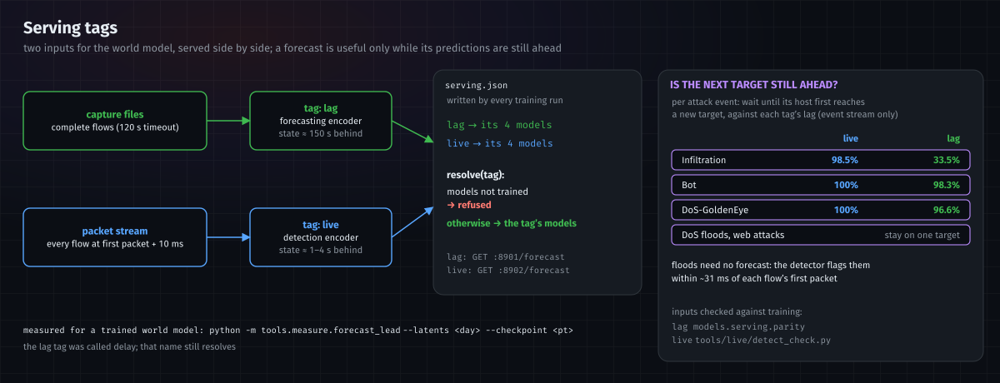

# Serving

How the trained models are run on traffic: live detection, the world model's forecast services (`lag`, `live` and
replay), the forecast API, and the serving tags. For the models themselves, see [architecture.md](architecture.md).

---

## 1. The services

| service | command | input | answers | behind the wire |
|---|---|---|---|---|
| **detection** | `python -m models.serving.detect_live --interface <iface>` (or `--pcap -` from `dumpcap`) | this machine's packets | `GET :8902/detections` | ~31 ms after a flow's first packet ([§5](#5-serving-the-detector)) |
| **live forecast** (tag `live`) | the same process, with `--forecast` | the detection stream | `GET :8902/forecast` | 1–4 s ([§4](#4-serving-tags)) |
| **lag forecast** (tag `lag`) | `python -m models.serving.live --input <capture folder> --work <dir>` | this machine's traffic, as capture files | `GET :8901/forecast` | ~121–152 s ([§2](#2-how-the-lag-forecast-service-works)) |
| **replay** | `python -m models.world_model.service --load artifacts/current/world_model.pt --latents artifacts/current/latents/<day> --node-index data/events/<day>/node_index.parquet` | a recorded dataset day, 256 events every 3 s, restarting at the day's end | `GET :8900/forecast` | — |

All serve the models in `artifacts/current/` ([training.md](training.md#the-artifacts-folder)), read through
`artifacts/current/serving.json` unless `--registry` names another. The three forecast services answer with the same
payload ([§3](#3-the-forecast-api)). The lag service needs a capture running into its input folder, for example
`dumpcap -i eth0 -F pcap -b duration:30 -b files:40 -w <capture folder>/live.pcap`; the detection service reads packets
from an interface or a pipe. Capture needs root; the services themselves do not. The launcher
(`~/netwatch-data/start.sh`, run as root) starts all of them.

---

## 2. How the lag forecast service works



Each time a capture file finishes, one **cycle** brings the state up to date. Ingest is incremental: every packet goes
through tshark once and through CICFlowMeter once, so a cycle's ingest cost follows the new traffic, not the window.

| step | what | why |
|---|---|---|
| 1. parse the new file | tshark on the file that just closed, once; its packets are cached while the file is in the window | packets need no context from other files |
| 2. extend the flow stream | the file is appended to one CICFlowMeter process that has read every file since the service started (`tools/live/StreamMeter.java`); it writes each flow the moment it is final | one continuous capture, so no flow is cut at a file boundary and long connections are split exactly where a whole-capture run splits them (checked by `tools/live/stream_check.py`) |
| 3. keep complete flows only | flows that started at least 120 s before the newest packet (and 120 s after the window's first) | CICFlowMeter closes every flow within 120 s of its start, so these flows are final — the same flows, with the same records, a whole-day ingest produces |
| 4. assemble the window | the cached packets and complete flows of the latest 16 files (8 min), and the packet-to-flow map over them, laid out exactly as a whole-window ingest writes them | the models read the same folder layout as in training |
| 5. encoders | side features, flow records, flow encoder, forecasting encoder, compressor | the event stream rebuilt for this window, exactly as in training |
| 6. world model | scores the window, rolls the state forward | the payload |

**How old the answer is.** The state is as of *newest packet − 120 s*; the newest packet is up to one capture file (30 s)
old when the file closes, and a cycle took 1.5 s on a window of about 1,100 events. So the forecast describes the
network about **121–152 s ago**, refreshed every 30 s. The payload reports it (`source.state_as_of`,
`source.lag_seconds`); display "network as of HH:MM:SS", never a countdown.

**How far ahead it looks.** A forecast step is one event, not a unit of time, so a forecast is ahead only when its
predicted connections come later than the service's lag. [§4](#4-serving-tags) measures how often that holds per
attack, for this tag and for `live`.

---

## 3. The forecast API

`GET /forecast` (any path works), JSON, CORS open, bound to 127.0.0.1. Poll every few seconds.

**Not connected:** `{"status": "NOT_CONNECTED", "reason": "<show verbatim>", "source": {…}}` — for example while the
first capture file is still being written (`lag`), or before the first forecast cycle (`live`).

**Connected:**

| field | content |
|---|---|
| `status` | `"CONNECTED"` |
| `score` | the score alerts are judged on: `next_event_pred_error` (surprise) or `target_probability` (ranking head) |
| `threshold` | `null` when the model is uncalibrated (then nothing alerts). Otherwise: `rule` in words (show this), `direction` (+1 alerts high, −1 low), `budget`, `threshold`, `calibrated_on`, and what was measured at it on test data: `fpr`, `recall`, `false_alarms`, per-hour rates, and the same with 3-in-a-row persistence |
| `source` | `mode` (`replay`, or `live` for this machine's traffic — never present one as the other), `day`, `position`, `total`, `t`. For this machine's traffic also `tag` (`lag` or `live`), `state_as_of`, `lag_seconds`, `cycle`, `build_seconds`, `local_ips` (this machine's addresses, to draw it as the local node); `lag` adds `newest_packet`, `hold_seconds`, `captures`; `live` adds `window_seconds` |
| `observed` | the current input: `edges` (per link: `sender_ip`, `receiver_ip`, `events`, `value`, `severity`), `alerts` (the latest events past the threshold), `events` |
| `predicted_edges` | one row per (seed, step): `step`, `seed_event`, `sender_ip`, `receiver_ip`, `probability`, `surprise`, `value`, `severity`, `candidates` (the leading alternative targets), `cumulative_risk`, `on_manifold`. **A predicted link has not happened** |
| `alerts` | one per predicted link that crosses the threshold, at the first step it does (`crosses_at_step`) |
| `current_state`, `future_states`, `rollout_steps` | `"S[t]"`, `["S[t+1]" … "S[t+K]"]`, `K` |
| `step_value`, `alert_share` | per step: the predicted link closest to alerting, and the share of predicted links past the threshold (a share, not a probability) |
| `explanation` | per forecast seed: the peers the seed host attended to most, with their attention share (`attended: [{ip, node, attention}]`). Join to `predicted_edges` on `seed_event` |
| `predicted_stage` | always `""` — no attack-stage model exists |
| `caveats` | strings stating the limits of this answer; show all of them |

**Display rules.** Draw one state at a time: the observed links as context, then each step's predicted links on top, so
predictions attach to the graph. Predicted links must look different from observed ones, and nothing predicted is
styled as an alert unless its `severity` is set. Always show the threshold rule and its measured recall. Label a replay
as a recorded dataset day. Describe an explanation as "the model attended to", never as a cause.

---

## 4. Serving tags



The world model is served from two inputs, each a **tag** (`models/serving/registry.py`), side by side so either can be
chosen by what it measures:

| tag | runner | input | state behind the wire | models |
|---|---|---|---|---|
| `lag` | `models.serving.live`, `GET :8901/forecast` | capture files, complete flows | ~150 s: the 120 s flow timeout, up to one 30 s file, ~1.5 s processing | forecasting encoder (with flow records), compressor, world model |
| `live` | `models.serving.detect_live --forecast`, `GET :8902/forecast` | the detection stream: every flow 10 ms after its first packet | 1–4 s measured (a forecast every 5 s, ~0.3 s each); up to ~16 s under a flood, where a 50,000-event window takes 8 s | detection encoder (no flow records), and a compressor and world model trained on its output |

`lag` was called `delay`; that name still resolves. `serving.json`, written into every training run and into
`artifacts/current/`, names each tag's models. `live` is refused until its pair is trained: `tools/train_all.sh` trains
it after the `lag` models (stages `b9live`, `latents_live`, `b10live`, `calibration_live`, ~9.5 h), and a run that
finished without them gets them with `RUN_DIR=<run> tools/train_all.sh`.

**Why both.** A forecast is six predicted connections, not a time span, so it is useful only if they are still in the
future when served. Measured from the event stream alone (no model), for each attack event, how long until its attacking host
first reaches a host it had never contacted:

| attack | reaches a new host later | median wait | still ahead at 1 s (`live`) | at 150 s (`lag`) |
|---|---|---|---|---|
| Infiltration | 99.8% | 32 s | 98.5% | 33.5% |
| Bot | 98.9% | 80 min | 100% | 98.3% |
| DoS-GoldenEye | 33.5% | 71 min | 100% | 96.6% |
| DoS-Hulk, DoS-SlowHTTPTest, DoS-Slowloris, web attacks | 0–3% | — | — | — |

Floods and web attacks stay on one target, so there is nothing ahead to forecast; the detector covers them. Slow
campaigns are ahead under either tag; lateral movement at Infiltration's pace only under `live`.
`tools/measure/forecast_lead.py` measures the same for a trained world model's own predictions, per tag lag.

**The tolerance test** (`models/serving/parity.py`) runs one capture through the training-style ingest and through the
`lag` path and compares them flow by flow:

| stage | must match |
|---|---|
| flows, event, 20-packet summary, side features, flow record, the flow encoder's `h` | always (exactly, or to float precision) |
| per-host features, the compressor's `z`, the world model's surprise | reported: a `lag` window starts with empty memory, by design |

Run it with `python -m models.serving.parity --registry artifacts/current/serving.json --tag <lag|self> --pcap <capture>
--out <report>`; `--tag self` compares the reference with itself. The `live` tag's inputs are checked by
`tools/live/detect_check.py` ([§5](#5-serving-the-detector)).

---

## 5. Serving the detector

| part | what it does |
|---|---|
| `models/serving/detect_live.py` | fast live detection: packets in, every flow scored 10 ms after its first packet (below) |
| `models/serving/cascade.py` | the detection encoder and detector held in memory: an event's features in, a verdict out; the context encoder's memory carries across calls |
| `models/serving/graph.py` | the stream's graph built incrementally: stable host ids, link ids, online neighbourhoods, time since last seen, reordering by `t_obs`. Each is checked against its offline twin |
| `models/serving/emitter.py` | score to alert: 3 consecutive events above threshold on one host, and alerts with no quiet gap longer than 60 s merged into one incident |
| `huggingface/model/` | a Hugging Face Inference Endpoint scoring the detector's 132-number input |

Operating point: each family is served at its own threshold, committed into its head as `serve_threshold` at the 0.01%
false-alarm budget by the training script ([training.md §6](training.md#6-the-detectors-operating-point)); the live
detector's `--budget` serves a head's stored threshold at another budget instead.

### Fast live detection


The detection path reads what a flow shows within 10 ms of its first packet, so unlike the forecast it does not wait
for flows to finish. `models/serving/detect_live.py` runs it on a packet stream, with the trained models unchanged:

```bash
uv run python -m models.serving.detect_live --interface eth0            # capture rights needed, as for dumpcap
dumpcap -i eth0 -F pcap -w - | uv run python -m models.serving.detect_live --pcap -
uv run python -m models.serving.detect_live --pcap capture.pcap --once  # replay a file, print a summary
```

| step | what runs |
|---|---|
| packets | one `tshark` process with ingest's own field list and options; its dissector state is reset every 250,000 packets, as ingest's chunking does |
| flows | CICFlowMeter's flow rules in Python: a 5-tuple in either direction, ended by a FIN or 120 s after its start; IPv4 TCP and UDP |
| the event | at `t_obs` = first packet + 10 ms (earlier if a FIN closes the flow): the packets seen by then, `reversed`, `dt_src`, `dt_dst`, `port_delta`, `dst_port_new`, sender and receiver |
| flow encoder | the training functions themselves (`prepare`, `normalise`, `embed`) → `h` |
| detection encoder | the same 512-event batches, link memory, neighbourhoods and late 20-packet summaries as training → `s` |
| detector | every head in `detector/` on `[h, s]`; each family alerts at its own committed threshold (0.01% budget), then the alert rules above |

Models default to `artifacts/current` (`flow_encoder.pt`, `detection_encoder.pt`, `detector/head_*.pt`).
`GET :8902/detections` returns the counters, recent detections, incidents and latency. With `--forecast` it also
serves the `live` world-model tag at `GET :8902/forecast` ([§4](#4-serving-tags)). The launcher starts it behind a
second `dumpcap` once a promoted run has `detection_encoder.pt`, with `--forecast` once it also has
`live_world_model.pt`.

**Latency.** Measured with a dataset capture paced in real time: a verdict 21 ms (median) and 37 ms (99th
percentile) after `t_obs`, about 31 ms after a flow's first packet. On a quiet link the clock is the wall clock less
`--grace` (20 ms), which gives `tshark` time to print packets captured just before `t_obs`. Under load, packets
move the clock themselves.

**Throughput**, one CPU core: about 12,000 packets/s — 11,700 on 56,393 packets of DoS-Slowloris traffic, 12,500
(2,440 flows/s) on 1,476,703 packets of DoS-Hulk traffic, peak memory 1.3 GB. The limit is Python's packet parsing
and the models; `tshark` alone reads about 34,000 packets/s. Traffic above the limit queues, and the delay grows with
the queue.

**Agreement with training** (`tools/live/detect_check.py`, Thursday-15-02-2018):

| check | result |
|---|---|
| detection encoder, streamed in random-size groups, against training's own code (20,000 events) | largest difference 2.3e-5 of the largest value; lowest cosine 0.9999998 |
| flows found, of those training built from CICFlowMeter's own packets (DoS capture, 300 s) | 333 of 333 |
| `h`; `reversed`; 20-packet summary | identical on 100% |
| `t_obs`; `port_delta`, `dst_port_new`; `dt_src`, `dt_dst` | 97.0%; 99.7%, 99.1%; 98.8%, 98.5% |
| benign test events of one capture (1,349), at the 0.1% budget's thresholds | GoldenEye 0.15%, Slowloris 5.41% above threshold — the same rates training's saved scores give |
| the same events, at the served 0.01% thresholds | the verdict differs on 5 events (0.37%), all one burst of port probes from one host; median probability difference 2.5e-7 |

**Where it can differ from training.**
- A flow's 20-packet summary is final at its 20th packet or FIN. A shorter flow without a FIN is known to be finished
  only at the 120 s timeout, so its summary reaches link memory later than in training. Measured: `s` changed by at
  most 0.001 and no verdict changed.
- Every flow is scored at `t_obs`, as training scored every event. CICFlowMeter drops a flow that never gets a second
  packet, which cannot be known 10 ms in (0.3% of flows on the DoS capture).
- Training's packet-to-flow map is an interval join on CICFlowMeter's second-resolution start times, and it
  occasionally gives a short flow the packets of the next connection. The live tracker assigns packets as CICFlowMeter
  does.
- A connection already running when the service starts is cut into 120 s pieces from the moment it is first seen.
- Training's stream merges every capture of a day — the whole network — and link memory is refreshed every 512 of its
  events. One sensor's stream holds only its own traffic, so its 512 events span more time and memory is refreshed at
  other moments. Scores of a burst on one link can move with it: on the check above, one 5-event port probe crossed the
  0.01% threshold live and not in training. The same stream also gives less context for a host that talks to other
  sensors' machines.
- Host history (`dt_src`, `dt_dst`, the port features) is updated in scoring order, which follows `t_obs`; ingest
  follows the first packet. They differ only around flows closed by a FIN inside the 10 ms, and a gap is never negative.

**Heads from other days.** Each head was trained against its own day's benign traffic. On another day's traffic its
calibrated rate does not hold. On 15 minutes of one benign Thursday-15-02-2018 host, replayed from a cold start, the
Infiltration head (from Thursday-01-03-2018) passed its threshold on 24% of events. On Slowloris traffic every head
fired, not only the Slowloris one. `--detector` takes one head file to serve a single day's families.
